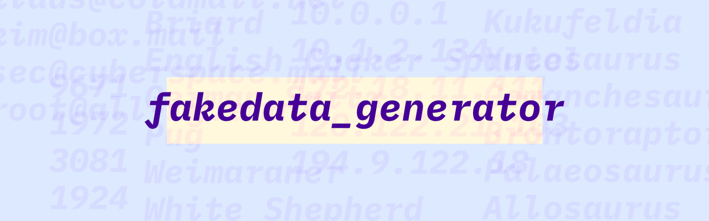

# `fakedata_generator`
> A rust library to generate fake data




[](https://crates.io/crates/fakedata_generator)
[](https://docs.rs/fakedata_generator/)

## Table of contents
<!-- BEGIN mktoc -->

- [Table of contents](#table-of-contents)
- [About](#about)
- [Usage](#usage)
- [Generators](#generators)
  - [Generators without arguments](#generators-without-arguments)
    - [email](#email)
    - [username](#username)
    - [domain](#domain)
    - [http method](#http-method)
    - [ipv4](#ipv4)
    - [gen_prime](#gen_prime)
    - [enum](#enum)
    - [int](#int)
    - [private ipv4](#private-ipv4)
    - [passwords](#passwords)
      - [Without special chars](#without-special-chars)
      - [With special chars](#with-special-chars)
  - [Corpora generator](#corpora-generator)
- [Users](#users)
- [Contributing](#contributing)
  - [Where to start?](#where-to-start)
  - [Tooling](#tooling)
- [Code of Conduct](#code-of-conduct)
- [License](#license)
<!-- END mktoc -->

## About
[⬆️ Back to Top](#table-of-contents)

This library provides functions to generate random values ("fake data"). It is in its early stages and some values are not yet fully random. Basic documentation is provided below and on [https://docs.rs/fakedata_generator/](https://docs.rs/fakedata_generator/). 

## Usage
[⬆️ Back to Top](#table-of-contents)

Add the library as dependency to your `Cargo.toml`.

```
[dependencies]
fakedata_generator = "0.7"
```

Now the the library can be loaded with `use fakedata_generator::*`.    

```rust
extern crate fakedata_generator;
use fakedata_generator::*;

fn main() {
    let random_word = gen_enum("some,random,words".to_string());
    println!("Random word is: {}", random_word); 
}
```

A full list of available generators and their function signature is shown below. 

## Generators

### Generators without arguments
[⬆️ Back to Top](#table-of-contents)

#### email

Return a random e-Mail address which is a combination of the username and domain generator.

Function signature
```rust
gen_email() -> String
```

Example call
```shell
let email: String = gen_email();
// email = shaneIxD@we.net
```

#### username

Return a random username.

*Note:* predefined list as of `v0.2`.

Function signature
```rust
gen_username() -> String
```

Example call
```rust
let user: String = gen_username();
// user = ahmadajmi
```

#### domain

Return a random domain name.

*Note:* Does not yet support all TDLs and true random host names - it's created by a predefined list.

Function signature
```rust
gen_domain() -> String
```

Example call
```rust
let domain: String = gen_domain();
// domain = "names.us"
```

#### http method

Return a random HTTP method from a defined list.

Possible values: `"DELETE", "GET", "HEAD", "OPTION", "PATCH", "POST", "PUT"`

Function signature
```rust
gen_http_method() -> String
```

Example call
```rust
let method: String = gen_http_method();
// method = "GET"
```


#### ipv4

Returns a random IP address. Generates four numbers in the range of 0 - 255 which are written out in the format `{}.{}.{}.{}`. 

Function signature
```rust
gen_ipv4() -> String
``` 

Example call
```rust
let ip: String = gen_ipv4();
// ip = "168.11.40.75"
```

#### gen_prime

Returns one of the first 1000 prime numners, randomely.

Function signature
```rust
gen_prime() -> usize
``` 

Example call
```rust
let prime: usize = gen_prime();
// prime = 6323
```

#### gen_emoji

Returns a random emoji from the list defined in [src/data/emojis.rs](src/data/emojis.rs). 

The list is automatically generated from [https://www.unicode.org/Public/17.0.0/emoji/emoji-test.txt](https://www.unicode.org/Public/17.0.0/emoji/emoji-test.txt) using the script in [helpers/add-emojis.nu](helpers/add-emojis.nu)

Function signature
```rust
gen_emoji() -> usize
``` 

Example call
```rust
let emoji: String = gen_emoji();
// emoji = ✊
```
### Generators with arguments
[⬆️ Back to Top](#table-of-contents)

#### enum

Return random string from set of specified strings. Specify a comma separated list as argument.

Function signature
```rust
gen_enum(input: String) -> String
```

Example call
```rust
let word: String = gen_enum("hello,hola,hallo".to_string());
// word = "hola"
```

#### int

Return random integer in range. Must specify 1 or 2 numbers separated by comma. If 1 argument is specified it is handled as "highest" value and `0` is used as lowest value. 

Function signature
```rust
gen_int(input: String) -> String
```

Example call
```rust
let num: String = gen_enum("1,100".to_string());
// num = "42"
```

#### private ipv4

Creates a private IPv4 address in one of these 3 ranges:

- 10.0.0.0 – 10.255.255.255
- 172.16.0.0 – 172.31.255.255
- 192.168.0.0 – 192.168.255.255

The `input` is the number of the first block and can be `10`, `172`, or `192`. If an invalid value is specified it defaults to `10`.

Function signature
```rust
gen_private_ip(input: usize) -> String
```

Example call
```rust
let private_ipv4: String = gen_private_ipv4(10);
// num = 10.64.197.255
```

#### passwords

##### Without special chars
Creates a random string.

The `input` is the number of characters the password should consist of.

Function signature
```rust
gen_password(input: usize) -> String
```

Example call
```rust
let pw: String = gen_password(32);
// pw = "bNNpAmShvQYbKbMdhByK17lqaFcgarrF"
```

##### With special chars
Creates a random string with special chars.

The `input` is the number of characters the password should consist of.

Function signature
```rust
gen_password_with_special_chars(input: usize) -> String
```

Example call
```rust
let pw: String = gen_password_with_special_chars(32);
// pw = "F=>:e+KX;Uu/Zg#i*MQN//6r%a^K?K°0"
```

### Corpora generator
[⬆️ Back to Top](#table-of-contents)

`gen_corpora_switch` is deprecated and should not be used anymore.

Instead there's a new `gen_switch` function that gets its data in JSON format taken from the [Corpora Project](https://github.com/dariusk/corpora). A copy of the entire Corpora project is included in the `data` directory.
Not all data sets are available as of now. See the [src/data/corpora.rs](https://github.com/KevinGimbel/fakedata_generator/blob/master/src/data/corpora.rs) file for all available sets.

Possible input values: 
- `cats`
- `dinosaurs`
- `dogs`
- `donkeys`
- `horses`
- `tv_shows`
- `fruits`
- `pizzatoppings`
- `herbs`
- `spices`
- `mixtures`
- `teas`
- `vegetables`
- `rpgs`
- `board_games`
- `wrestling_moves`
- `countries`
- `nationalities`
- `governmentforms`
- `authors`
- `bodyparts`
- `firstnames`
- `lastnames`
- `moods`
- `neutralnames`
- `occupations`
- `prefixes`
- `scientists`
- `suffixes`
- `tolkien_character_names`
- `fabrics`
- `gemstones`
- `metals`
- `packaging`
- `music_genres`
- `objects`
- `flowers`
- `toxic_plants`
- `weather_conditions`
- `sports`
- `appliances`
- `new_technologies`
- `programming_languages`

Each of these will return a random word from the list.

Function signature
```rust
gen_switch(input: String) -> String
```

Example call
```rust
let word: String = gen_switch("cats".to_string());
// word = "European Shorthair"

let fabric: String = gen_switch("fabrics".to_string());
// word = "longcloth"
```

## Users
[⬆️ Back to Top](#table-of-contents)

The following is a list of projects using `fakedata_generator`. Want to have your project added? Open a PR! 🧡

| Name | Description | Repository |
|------|-------------|------------|
| `fakedata_server` | A HTTP API providing random values based on `fakedata_generator` data. | [View code](https://github.com/kevingimbel/fakedata_server) |
| `vector` | [vector](https://github.com/vectordotdev/vector) is a  high-performance observability data pipeline. They use `fakedata_generator` as part of their test setup. | [View code](https://github.com/vectordotdev/vector/tree/master/lib/fakedata) |
| `oxidecomputer/crucible` | Crucible is a distributed network-replicated block storage service. They use `fakedata_generator` as part of their test setup. | [View code](https://github.com/oxidecomputer/crucible/blob/ec87da9b0d8997a8c1c969a11d7d41583526ad20/upstairs/src/volume.rs#L1962) |


## Contributing
[⬆️ Back to Top](#table-of-contents)

We love and welcome every form of contribution.

### Where to start?

Here are some good places to start:

* Issues with label [Good first issue](https://github.com/kevingimbel/fakedata_generator/labels/good%20first%20issue)
* Issues with label [Documentation](https://github.com/kevingimbel/fakedata_generator/labels/documentation)
* Providing example implementations or usage demos

### Tooling

- [mktoc](https://github.com/KevinGimbel/mktoc) is used for table of content generation in the README.md
- [grcov](https://github.com/mozilla/grcov) is used to generate the coverage badge
    - this is currently done by hand and not by CI, run `helpers/coverage.sh` to update the badge
- [nix](https://nix.dev/) for the dev environment (packages, tools, ...)

The nix environment can be setup with `nix develop`. It contains all tools needed to work with this code base, in pre-defined versions so everybody gets the same environment and the same packages.

## Code of Conduct
[⬆️ Back to Top](#table-of-contents)

You are expected to follow our [code of conduct](https://github.com/kevingimbel/fakedata_generator/blob/master/CODE_OF_CONDUCT.md) when interacting with the project via issues, pull requests or in any other form. Many thanks to the awesome [contributor covenant](https://www.contributor-covenant.org/) initiative!

## License
[⬆️ Back to Top](#table-of-contents)

[MIT License](https://github.com/kevingimbel/fakedata_generator/blob/master/LICENSE) Copyright (c) 2019 Kevin Gimbel

Special Thanks to the Rust Community, Rust Language Maintainers, and JetBrains for IntelliJ IDEA. See [NOTICE](https://github.com/kevingimbel/fakedata_generator/blob/master/NOTICE) for full list.
